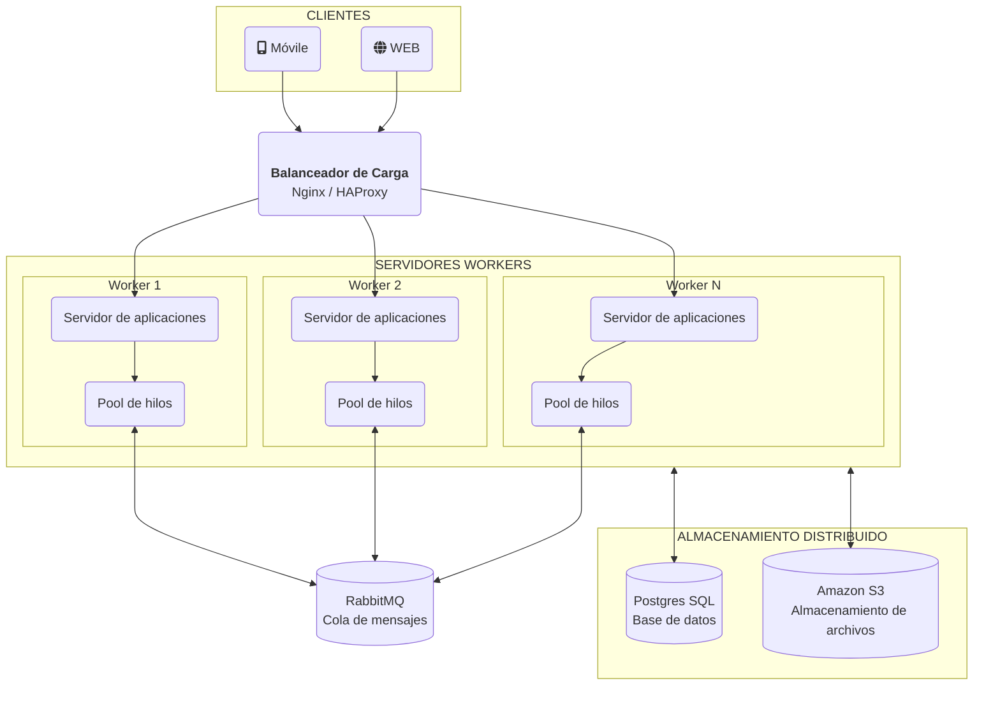

# PFO 3: Diagrama del Sistema Distribuido (Cliente-Servidor)

## 1. Diagrama de arquitectura

```mermaid
flowchart TD
    subgraph "CLIENTES"
        CM("fa:fa-mobile-screen Móvile")
        CW("fa:fa-globe WEB")
    end

    BC("`fa:fa-chart-diagram
    **Balanceador de Carga**
    Nginx / HAProxy`")

    CM --> BC
    CW --> BC

    subgraph Servers["SERVIDORES WORKERS"]
        subgraph W1["Worker 1"]
            SA1("Servidor de aplicaciones") --> PH1("Pool de hilos")
        end

        subgraph W2["Worker 2"]
            SA2("Servidor de aplicaciones") --> PH2("Pool de hilos")
        end

        subgraph WN["Worker N"]
            SA3("Servidor de aplicaciones") --> PH3("Pool de hilos")
        end
    end

    BC --> SA1
    BC --> SA2
    BC --> SA3

    subgraph Empty[ ]

        MQ[("RabbitMQ\nCola de mensajes")]

        subgraph "ALMACENAMIENTO DISTRIBUIDO"
            DB[("Postgres SQL\nBase de datos")]
            S3[("Amazon S3\nAlmacenamiento de archivos")]
        end
    end

    
    PH1 <--> MQ
    PH2 <--> MQ
    PH3 <--> MQ

    %% W1 <--> DB
    %% W2 <--> DB
    %% WN <--> DB
    Servers <--> DB

    %% W1 <--> S3
    %% W2 <--> S3
    %% WN <--> S3
    Servers <--> S3

style Empty fill:transparent,stroke:transparent
```